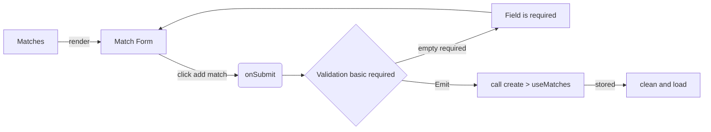

# Architectura -- Tennis Ladder

## Overview

- Tennis Ladder is a Vue3 + Tailwindcss + Supabase local.
- The application is organized so that the views coordinate the UI.
- The composables contain the client-side resource logic.
- The API is responsible for communicating with supabase.

At the current version there is no Pinia still. Most state is held in Vue refs inside composables.

## How a screen gets its data

- Vue Router selects the view for the current URL with meta public/required auth.
- The view obtains the current ladder id from the route when necessary ${to.params.id}.
- The view creates the required composables, such as usePlayers or useMatches.
- The view render the components, such Form and Card for list

## Create match

- the form only has required, no include validating.
- When click "submit", the component actives the function onsubmit.
- THe function onsubmit emit the event submit with dataForm
- THe emit call to create in useMatches.
- When create new match, clear inputs.
- active load().

## API

La API del proyecto Tennis Ladder, consume directamente la API de supabase. En la carpeta supabase puedes encontrar las estructuras de las tablas, los tipos de datos de las columnas, la configuracion de migraciones, seeder para llenar la data inicial. En los registros iniciales vienen dos usuarios para ingresar al portal, Alicia y Bob, para mas detalle leer el archivo README.md. Para conectar con la api de supabase es necesario las variables de entorno, VITE_SUPABASE_URL: string y VITE_SUPABASE_ANON_KEY:string. a, en el README.md de proyecto estan los pasos para obtener los valores de las variables. La API del proyecThe current API Modules are:

- auth.ts
  With supabase authentication
  - signIn
  - signUp
  - signOut
  - getSession
  - onAuthStateChange

- ladders.ts
  With supabase
  - list
  - create (name, ownerId)
  - rename (update) params(id, name)
  - remove (id)
  - getById (id)
- players.ts
  With supabase
  - listByLadder(id)
  - create (ladderId, playerName)
  - rename (id, name)
  - remove (id)
- matches.ts
  With supabase
  - listByLadder(id)
  - create (type Match in domain.ts)
  - remove (id)

## Components

In the folder have folder for each {ladders, matches, players, standing} and UI [Button, and more]
The structure is card/form
UI with variant styles

## Composables

All composables connect with API
Vue refs

## Types

Supabase and types for match, standing and others

## Router

Vue router has routes with meta for public and required auth
router call to view
routes provides ladder id from
validating with beforeEach to

## Utils

Functions to format Date

## Styles

import Tailwindcss
